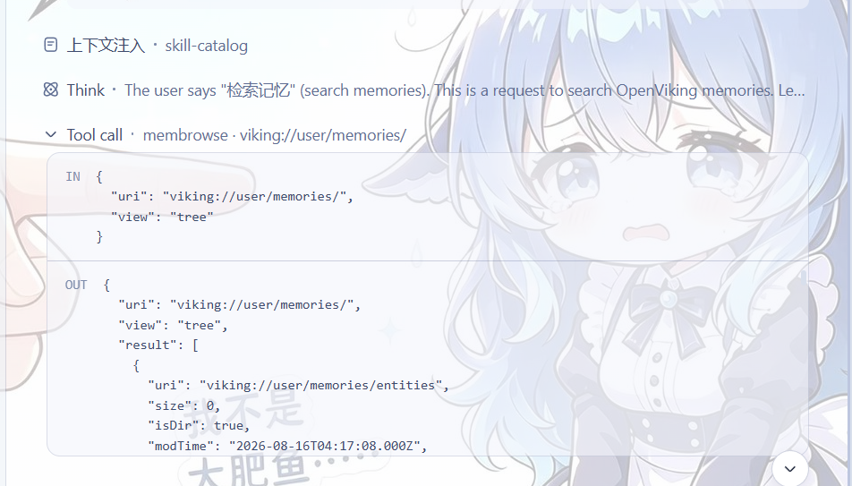

[](LICENSE)
[](package.json)
[](https://www.typescriptlang.org/)
[](https://deepseek-harness.github.io/deepseek-harness/)
[](https://github.com/volcengine/OpenViking)

[简体中文](README.md) | **English**

# dsh-openviking

OpenViking retrieval, resource management, auto-recall (user + agent dual
spaces) and session memory for
[DeepSeek Harness](https://deepseek-harness.github.io/deepseek-harness/).

## Features

| Tool | Description |
| --- | --- |
| `memsearch` | Semantic search (`auto`/`fast`/`deep`; deep uses session context) |
| `memfind` | Fast semantic find without session context |
| `memread` | Read a `viking://` URI (`abstract`/`overview`/`read`/`auto`) |
| `membrowse` | Browse the `viking://` filesystem (`list`/`tree`/`stat`) |
| `memgrep` | Exact/regex content search (default `viking://resources/`) |
| `memglob` | Enumerate files by glob pattern |
| `memadd` | Add a remote URL or local text file under `viking://resources/` |
| `memremove` | Remove a resource — requires literal `confirm: true` |
| `memqueue` | Observer queue status |
| `memcommit` | Commit the current session and extract persistent memories |
| `memlearn` | Deliberately capture a lesson (merge into existing memory) or mint/update a skill playbook; secret-redacted, deduplicated, injected into the current turn |

Also: indexed repository context, auto recall via the context-injection
channel, and session sync + auto
commit.



## Why OpenViking?

| Dimension | Local file / SQLite approach | OpenViking approach (this plugin) |
| --- | --- | --- |
| Recall | Keyword / FTS5 exact matching | Semantic retrieval: vector recall + L0/L1 abstract-layer targeting |
| Content forms | Only text you write yourself | Memories, resources and skills in one `viking://` virtual filesystem; remote URLs and local files can be `memadd`-ed into the library as searchable resources |
| Context cost | Full-context injection or hand-trimmed summaries | Three tiers — L0 abstract (one sentence) → L1 overview (key points) → L2 full text — **loaded on demand**, saving tokens |
| Cross-tool | One memory silo per tool | **One shared memory across tools**: Claude Code, Codex, MCP clients, the `ov` CLI and DSH all read/write the same library |
| Maintenance | Manual curation | An observer queue does embedding, summarization and content reorganization automatically (`memqueue` shows the status) |

## Quick start

```sh
# One-shot install from the GitHub repo (prebuilt lib/ included — no build
# authorization required):
sh install.sh [profile-name]          # default profile: dsh-openviking

# Or install manually:
dsh plugin --profile <name> add github:Rxiain/dsh-openviking
dsh --profile <name>
```

Config defaults point at `http://localhost:1933`. To override anything, put
the **complete** config under `id: openviking` in your profile's
`cordis.patch.yml` (patches replace the whole `config`, they don't merge):

```yaml
- id: openviking
  config:
    # OpenViking HTTP service base URL
    endpoint: 'http://localhost:1933'
    # X-API-Key auth header; empty omits it. Prefer env binding; never commit real keys
    apiKey: !!js process.env.OPENVIKING_API_KEY ?? ''
    # X-OpenViking-Account tenant header; empty omits it
    account: ''
    # X-OpenViking-User user header; empty omits it
    user: ''
    # X-OpenViking-Agent agent header; empty omits it
    agentId: 'deepseek-harness'
    # Per-request timeout in ms; 1000–300000
    timeoutMs: 30000
    # Session-sync state file (`~` expanded); message ids only, never bodies or keys
    stateFile: '~/.dsh/openviking/state.json'
    # Inject the indexed-repository list into the prompt
    repoContext:
      enabled: true
      # Repository-list cache TTL in ms; 1000–3600000
      cacheTtlMs: 60000
    # Auto-recall relevant memories before each model step
    autoRecall:
      enabled: true
      # Max memories injected per turn; 1–50
      limit: 6
      # Minimum score for filler memories; 0–1
      scoreThreshold: 0.15
      # Per-memory content cap in chars; 100–5000
      maxContentChars: 500
      # Injection budget ≈ tokenBudget × 4 chars; 100–10000
      tokenBudget: 2000
      # Also search the agent space (cases/patterns/tools/skills memories, skill playbooks)
      agentSpaces: true
      # Mid-message refresh every N tool steps; injects only new memories (0 disables)
      refreshSteps: 10
      # Memory map: injected at session start, then refreshed every N user turns (1 = start only, 0 = never)
      startupMapEveryTurns: 5
    # Auto-commit on a user-turn rhythm
    autoCommit:
      enabled: true
      # Commit after N uncommitted user turns (0 disables the turn trigger)
      turns: 3
      # Wall-clock fallback: flush dirty sessions older than this (after the first commit)
      intervalMinutes: 10
```


## Create an account and API key

Admin commands need the root key (for a local service, usually in
`~/.openviking/root_api_key.txt`):

```sh
ROOT=$(cat ~/.openviking/root_api_key.txt)
printf '{"url":"http://localhost:1933","api_key":"%s"}' "$ROOT" > /tmp/ov-root.conf
export OPENVIKING_CLI_CONFIG_FILE=/tmp/ov-root.conf

ov admin create-account dsh --admin dsh-admin   # create account dsh + first admin; prints its key
ov admin register-user dsh dsh --role user      # register regular user dsh in account dsh; prints its key
ov admin regenerate-key dsh dsh                 # regenerate a key (old key immediately invalidated)

unset OPENVIKING_CLI_CONFIG_FILE && rm -f /tmp/ov-root.conf
```

Put the returned key in the plugin's `apiKey`, and the matching account/user
in `account`/`user`.

## Contributing

Contributions are welcome:

1. Fork the repository and create a feature branch (`git checkout -b feature/your-change`)
2. Make the change and add or update tests
3. Run `npm test` to verify (the default suite needs no OpenViking service)
4. Commit and open a pull request

## License & credits

[MIT](LICENSE)

References:

- [@tanyouqing/pi-openviking](https://pi.dev/packages/@tanyouqing/pi-openviking) ([source](https://github.com/tanyouqing/Opencode_openviking-plugin))
- Upstream: [volcengine/OpenViking](https://github.com/volcengine/OpenViking)
